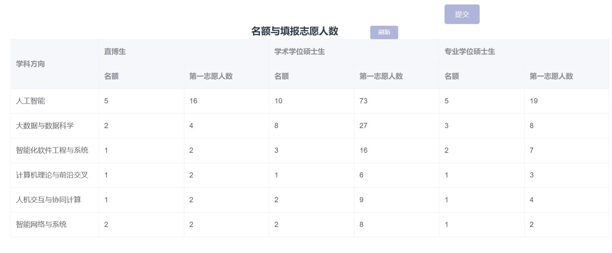

复旦计科
=====================================

复旦的招生分为夏令营和九推，夏令营的招生人数没有九推多，但是某些实验室会有实验室单独面试的情况。拿FudanNLP来说，最好在初筛通过后提前联系老师，并在夏令营之前参加组内面试，确定名额，避免出现通过了学院面试却没有实验室名额的情况。一般而言，到九推的时候，复旦NLP实验室是没有名额的，2021年在九推的时候只剩下1个硕士名额，有几十个人争，竞争非常激烈，其余都是提前预定好，或者在夏令营期间定下来的。

在夏令营阶段强com，竞争相对比较激烈，主要体现在教务处对每个 学校-学院 直接卡前 n 入营，所以没有入营的同学也不要放弃，因为预推免（在9月）的时候，因为很多大佬拿了优于复旦计科的offer，入营的 bar 会有明显的降低。然后夏令营与预推免是完全分开的，因此夏令营拿了 waitlist 也可以继续报名，相当于在两个队列排队，都有可能上岸。

招生规模
--------------------------------------

专硕较多，学硕较少，直博不少。复旦的专硕也是没有宿舍的，但是会有一些四人间（不是很确定）的低租公寓提供，距离学校十几分钟。

面试流程
--------------------------------------

复旦计科的考核分为三大块：编程、英语面试和综合面试。编程不会太难，特别是在线上期间，是开卷编程，但是可能会在英语面试或者综合面试时问你相关的问题。英语面试考核基本的英语听说能力，表现得大方一点就行。综合面试主要会问你项目和科研，也可能会涉及到学业课程问题。一般面试完之后，根据你的表现，老师会给你打电话问你意向。

在方向方面，有实时博弈。可以参考下图（2022年）。

一些废话
--------------------------------------

如果学弟学妹一门心思想做科研，尤其是NLP方面的，欢迎来FudanNLP读，毕竟贵系和信科的NLP组看不太上南软。如果跟我一样，本科没怎么做过科研，对此有兴趣但是想骑墙的，可以提前联系老师要学硕名额，转直博也方便。另外，实验室的氛围非常好，GPU也极多。其他有问题欢迎联系我。

作者
--------------------------------------
:ref:`authors:奚志恒`, 陈梓俊